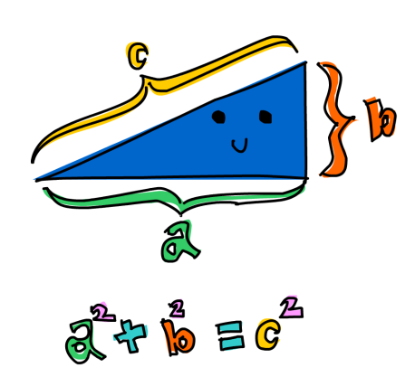

# Finding the Right Triangle

Let’s wrap things up with a problem that combines tuples and list comprehensions. We’ll use Haskell to find a right triangle that fits all of these conditions:

> - The lengths of the three sides are all integers.
> - The length of each side is less than or equal to 10.
> - The triangle’s perimeter (the sum of the side lengths) is equal to 24.

A triangle is a right triangle if one of its angles is a right angle (a 90-degree angle). Right triangles have the useful property that if you square the lengths of the sides forming the right angle and then add those squares, that sum is equal to the square of the length of the side that’s opposite the right angle. 

In the picture, the sides that lie next to the right angle are labeled `a` and `b`, and the side opposite the right angle is labeled `c`. We call that side the hypotenuse.
