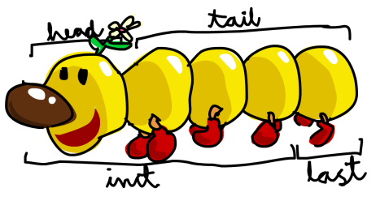

# More List Operations

Here are some more basic list functions, followed by examples of their usage:

- The `head` function takes a list and returns its head, or first element:

```haskell
ghci> head [5,4,3,2,1]
5
```

- The `tail` function takes a list and returns its tail. In other words, it chops off a list’s head:

```haskell
ghci> tail [5,4,3,2,1]
[4,3,2,1]
```

- The `last` function returns a list’s last element:

```haskell
ghci> last [5,4,3,2,1]
1
```

- The `init` function takes a list and returns everything except its last element:

```haskell
ghci> init [5,4,3,2,1]
[5,4,3,2]
```

To help us visualize these functions, we can think of a list as a monster, like this:



But what happens if we try to get the head of an empty list?

```haskell
ghci> head []
*** Exception: Prelude.head: empty list
```

Oh my—it blows up in our face! If there’s no monster, it doesn’t have a head. When using `head`, `tail`, `last`, and `init`, be careful not to use them on empty lists. This error cannot be caught at compile time, so it’s always good practice to take precautions against accidentally telling Haskell to give you elements from an empty list.

The `length` function takes a list and returns its length:

```haskell
ghci> length [5,4,3,2,1]
5
```

The `null` function checks if a list is empty. If it is, it returns `True`; otherwise, it returns `False`.

```haskell
ghci> null [1,2,3]
False
ghci> null []
True
```

The `reverse` function reverses a list:

```haskell
ghci> reverse [5,4,3,2,1]
[1,2,3,4,5]
```

The `take` function takes a number and a list. It extracts the specified number of elements from the beginning of the list, like this:

```haskell
ghci> take 3 [5,4,3,2,1]
[5,4,3]
ghci> take 1 [3,9,3]
[3]
ghci> take 5 [1,2]
[1,2]
ghci> take 0 [6,6,6]
[]
```

If we try to take more elements than there are in the list, Haskell just returns the entire list. If we take 0 elements, we get an empty list.

The `drop` function works in a similar way, only it drops (at most) the specified number of elements from the beginning of a list:

```haskell
ghci> drop 3 [8,4,2,1,5,6]
[1,5,6]
ghci> drop 0 [1,2,3,4]
[1,2,3,4]
ghci> drop 100 [1,2,3,4]
[]
```

The `maximum` function takes a list of items that can be put in some kind of order and returns the largest element. The `minimum` function is similar, but it returns the smallest item:

```haskell
ghci> maximum [1,9,2,3,4]
9
ghci> minimum [8,4,2,1,5,6]
1
```

The `sum` function takes a list of numbers and returns their sum. The `product` function takes a list of numbers and returns their product:

```haskell
ghci> sum [5,2,1,6,3,2,5,7]
31
ghci> product [6,2,1,2]
24
ghci> product [1,2,5,6,7,9,2,0]
0
```

The `elem` function takes an item and a list of items and tells us if that item is an element of the list. It’s usually called as an infix function because it’s easier to read that way:

```haskell
ghci> 4 `elem` [3,4,5,6]
True
ghci> 10 `elem` [3,4,5,6]
False
```